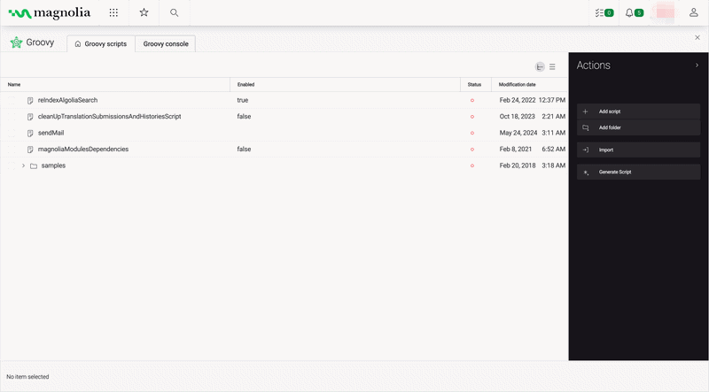

# Magnolia Groovy Generator

A RAG-powered web app for generating Magnolia CMS Groovy scripts using natural language prompts.

Live Site: [mgnl-groovy-generator-app](https://mgnl-groovy-generator-app.vercel.app/)


[▶ Watch Demo](https://drive.google.com/file/d/1pTJBK1EGd-dfmM8mIvov_rrAEOrY8xE7/view?usp=sharing)

## Overview

Magnolia Groovy Generator is a full-stack portfolio project that combines a FastAPI backend with a React + Vite frontend to generate context-aware Groovy scripts for Magnolia CMS. It uses Retrieval-Augmented Generation (RAG) to ground script generation on a curated set of example scripts, ensuring outputs are accurate and idiomatic.

## [`Magnolia CMS Integration`](./integrations/magnolia/INTEGRATION.md)

Beyond the web UI, the generator can be integrated directly into Magnolia CMS as a **custom action** — allowing editors and developers to generate and execute Groovy scripts without leaving the CMS.


[▶ Watch Demo](https://drive.google.com/file/d/12dixAMERaaCbuTUxM14ih4Z9g-1qXISh/view?usp=sharing)

### Sample Code

A reference implementation is available in [`./integrations/magnolia`](./integrations/magnolia), including:

- Custom action class calling the `/v1/generate` endpoint
- Action definition YAML for registering the action in a Magnolia app

### Prerequisites

- Magnolia CMS 6.3.x+
- The FastAPI backend running and accessible from the Magnolia instance
- `magnolia.groovyGenerator.url` configured in your Magnolia properties file

## Tech Stack

| Layer | Technology |
|||
| Frontend | React, Vite, Tailwind CSS |
| Backend | FastAPI, Python |
| LLM & Embeddings | Ollama (`mistral`, `nomic-embed-text`) |
| Vector Store | Qdrant |
| RAG Framework | LlamaIndex |
| CMS Integration | Magnolia CMS |

## Architecture


## Features

- Natural language to Groovy script generation
- RAG pipeline grounded on example Magnolia CMS scripts
- Expected properties input — tag-based field to guide script output
- Input guard rails — blocks non-Groovy and modification requests, if disabled (default)
- Output guard rails — validates and sanitizes generated scripts
- Retry logic — automatically retries if output contains unwanted content
- Rate limiting — 1 request per second per client
- Fully local — runs entirely on your machine with no cloud API required

## Prerequisites

- Python 3.11+
- Node.js 18+
- [Ollama](https://ollama.com) installed and running

## Getting Started
 
### 1. Clone the repository
 
```bash
git clone https://github.com/kirkalyn13/mgnl-groovy-generator
cd mgnl-groovy-generator
```
 
### 2. Set up environment variables
 
```bash
cp .env.example .env
```
 
Edit `.env`:
 
```env
QDRANT_URL=https://your-cluster-url
QDRANT_API_KEY=your_qdrant_key
COLLECTION_NAME=docs_collection_name
LLM_MODE=preferred_llm_mode_like_ollama
OLLAMA_URL=https://your-ollama-url
OLLAMA_EMBEDDING_MODEL=your_embedding_model
OLLAMA_LLM=your_ollama_llm
```
 
### 3. Install Python dependencies
 
```bash
python -m venv .venv
source .venv/bin/activate
pip install -r requirements.txt
```
 
### 4. Pull Ollama models
 
```bash
ollama pull nomic-embed-text
ollama pull mistral
```
 
### 5. Ingest your Groovy scripts
 
Add your `.groovy` example files to the `data/` folder, then run:
 
```bash
python ingest.py
```
 
### 6. Start the API
 
```bash
uvicorn app:app --reload --port 8000
```
 
## API Reference
 
Interactive docs available at [http://localhost:8000/docs](http://localhost:8000/docs) once the server is running.
 
### `POST /v1/generate`
 
Generate a Magnolia CMS Groovy script from a natural language query.
 
**Request**
```json
{
  "query": "Generate a Groovy script to retrieve all published pages",
  "workspaces": ["website"],
  "properties": ["pageTitle", "activationStatus", "path"],
  "allowModifications": false
}
```
 
**Response**
```json
{
  "success": true,
  "query": "Generate a Groovy script to retrieve all published pages",
  "script": "def hm = MgnlContext.getHierarchyManager...",
  "retries": 0,
  "message": null
}
```
 
### `POST /v1/ingest`
 
Ingest `.groovy` files from the data folder into Qdrant.
 
**Request**
```json
{
  "path": "./data"
}
```
 
**Response**
```json
{
  "success": true,
  "message": "Successfully ingested 12 documents."
}
```

### `GET /v1/review/{script_path}`
 
Reviews the groovy script pulled from `/{script_path}` from a Magnolia CMS instance.
 
**Response**
```json
{
    "success": true,
    "path": "magnoliaModulesDependencies",
    "review": "Here's a code review for the provided Magnolia CMS Groovy script:\n\n1. **Naming Conventions**: Adhere to consistent naming conventions throughout the script..."
}
```

### `GET /v1/describe/{script_path}`
 
Describes the groovy script pull from `/{script_path}` from a Magnolia CMS instance.
 
**Response**
```json
{
    "success": true,
    "path": "magnoliaModulesDependencies",
    "description": "This Groovy script is a utility for inspecting Magnolia module dependencies and version information..."
}
```

## Improvements

- Use a larger, more powerful model e.g. OpenAI gpt models
- Ingest more well-documented and labeled Groovy scripts.

## Authors

- [Engr. Kirk Alyn Santos](https://github.com/kirkalyn13)

## License

MIT