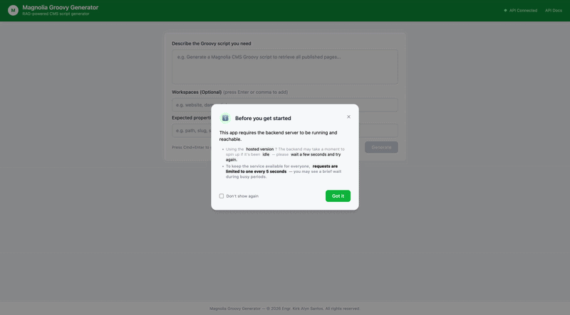
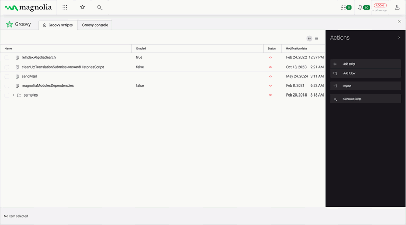
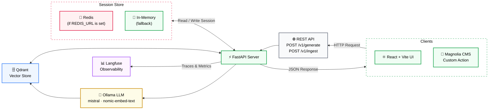
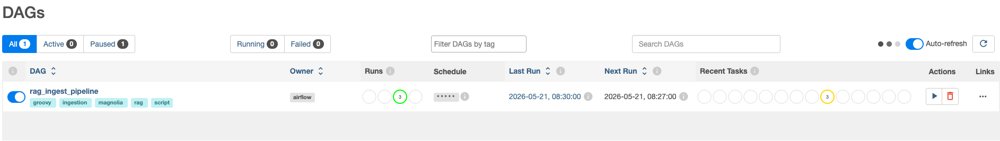
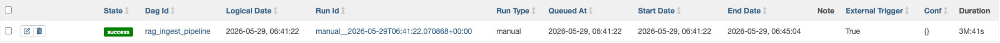
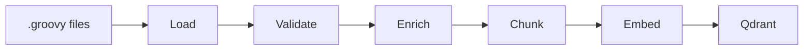
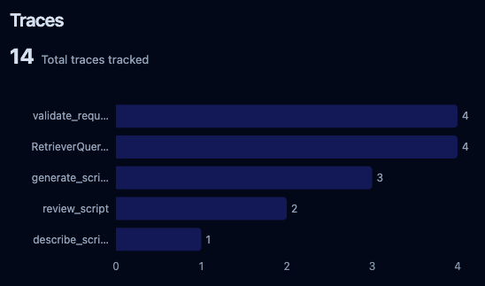
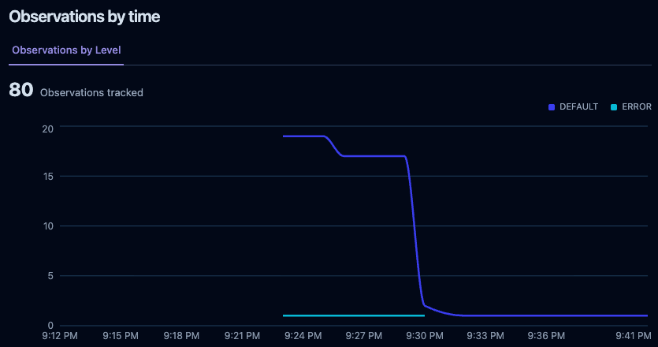
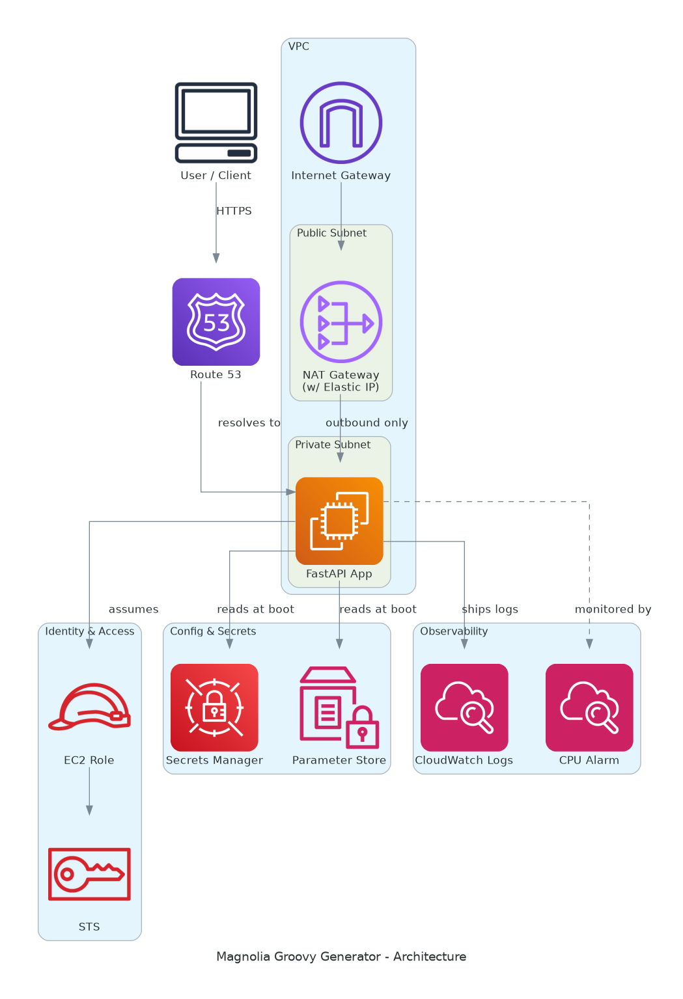

# Magnolia Groovy Generator

A RAG-powered web app for generating Magnolia CMS Groovy scripts using natural language prompts.

Live Site: [mgnl-groovy-generator-app](https://mgnl-groovy-generator-app.vercel.app/)


[▶ Watch Demo](https://drive.google.com/file/d/1pTJBK1EGd-dfmM8mIvov_rrAEOrY8xE7/view?usp=sharing)

## Overview

Magnolia Groovy Generator is a full-stack portfolio project that combines a FastAPI backend with a React + Vite frontend to generate context-aware Groovy scripts for Magnolia CMS. It uses Retrieval-Augmented Generation (RAG) to ground script generation on a curated set of example scripts, ensuring outputs are accurate and idiomatic.

## [`Magnolia CMS Integration`](./integrations/magnolia/INTEGRATION.md)

Beyond the web UI, the generator can be integrated directly into Magnolia CMS as a **custom action** — allowing editors and developers to generate and execute Groovy scripts without leaving the CMS.


[▶ Watch Demo](https://drive.google.com/file/d/12dixAMERaaCbuTUxM14ih4Z9g-1qXISh/view?usp=sharing)

### Sample Code

A reference implementation is available in [`./integrations/magnolia`](./integrations/magnolia), including:

- Custom action class calling the `/v1/generate` endpoint
- Action definition YAML for registering the action in a Magnolia app

### Prerequisites

- Magnolia CMS 6.3.x+
- The FastAPI backend running and accessible from the Magnolia instance
- Server URL and API Key configured in the Passwords app

## Tech Stack

| Layer | Technology |
|---|---|
| Frontend | React, Vite, Tailwind CSS |
| Backend | FastAPI, Python |
| LLM & Embeddings | Ollama (`mistral`, `nomic-embed-text`, `qwen3.5`) |
| Vector Store | Qdrant |
| RAG Framework | LlamaIndex |
| CMS Integration | Magnolia CMS |
| Observability | LangFuse |
| Memory | Redis |

## Architecture


```mermaid
flowchart RL

    subgraph CLIENTS["Clients"]
        direction TB
        REACT["⚛️   React + Vite UI"]
        MAGNOLIA["📝 Magnolia CMS
        Custom Action"]
    end

    subgraph SESSION["Session Store"]
        direction TB
        REDIS["🔴 Redis
        (if REDIS_URL is set)"]
        MEMORY["🧠 In-Memory
        (fallback)"]
    end

    CLIENTS -->|"HTTP Request"| REST["🌐 REST API
    POST /v1/generate
    POST /v1/ingest"]
    REST --> FASTAPI["⚡ FastAPI Server"]
    FASTAPI --> OLLAMA["🦙 Ollama LLM
    mistral · nomic-embed-text"]
    FASTAPI <--> QDRANT["🗄️ Qdrant
    Vector Store"]
    OLLAMA --> QDRANT
    FASTAPI -->|"JSON Response"| CLIENTS
    FASTAPI -->|"Traces & Metrics"| LANGFUSE["📊 Langfuse
    Observability"]
    FASTAPI <-->|"Read / Write Session"| SESSION

    style REACT fill:#f0fdf4,stroke:#16a34a,stroke-width:2px,color:#000000
    style MAGNOLIA fill:#f0fdf4,stroke:#16a34a,stroke-width:2px,color:#000000
    style CLIENTS fill:#ffffff,stroke:#16a34a,stroke-width:1px,stroke-dasharray:5,color:#000000
    style REST fill:#f9fafb,stroke:#6b7280,stroke-width:2px,color:#000000
    style FASTAPI fill:#f0fdf4,stroke:#16a34a,stroke-width:2px,color:#000000
    style OLLAMA fill:#fefce8,stroke:#ca8a04,stroke-width:2px,color:#000000
    style QDRANT fill:#eff6ff,stroke:#3b82f6,stroke-width:2px,color:#000000
    style LANGFUSE fill:#fdf4ff,stroke:#a855f7,stroke-width:2px,color:#000000
    style REDIS fill:#fff1f2,stroke:#e11d48,stroke-width:2px,color:#000000
    style MEMORY fill:#f0fdf4,stroke:#16a34a,stroke-width:2px,color:#000000
    style SESSION fill:#ffffff,stroke:#e11d48,stroke-width:1px,stroke-dasharray:5,color:#000000
```

## Features

- Natural language to Groovy script generation
- RAG pipeline grounded on example Magnolia CMS scripts
- Expected properties input — tag-based field to guide script output
- Input guard rails — blocks non-Groovy and modification requests, if disabled (default)
- Output guard rails — validates and sanitizes generated scripts
- Retry logic — automatically retries if output contains unwanted content
- Rate limiting — 1 request per second per client
- Fully local — runs entirely on your machine with no cloud API required
- Session Memory - remembers session requests to refine succeeding queries

## Prerequisites

- Python 3.11+
- Node.js 18+
- [Ollama](https://ollama.com) installed and running
- Redis (Optional)

## Getting Started
 
### 1. Clone the repository
 
```bash
git clone https://github.com/kirkalyn13/mgnl-groovy-generator
cd mgnl-groovy-generator
```
 
### 2. Set up environment variables
 
```bash
cp .env.example .env
```
 
Edit `.env`:
 
```env
QDRANT_URL=https://your-cluster-url
QDRANT_API_KEY=your_qdrant_key
COLLECTION_NAME=docs_collection_name
LLM_MODE=preferred_llm_mode_like_ollama
OLLAMA_URL=https://your-ollama-url
OLLAMA_EMBEDDING_MODEL=your_embedding_model
OLLAMA_LLM=your_ollama_llm
```
 
### 3. Install Python dependencies
 
```bash
python -m venv .venv
source .venv/bin/activate
pip install -r requirements.txt
```
 
### 4. Pull Ollama models
 
```bash
ollama pull mistral # For generative AI functions
ollama pull nomic-embed-text # For embedding
ollam pull qwen3.5  # For tool calling
```
 
### 5. Ingest your Groovy scripts
 
Add your `.groovy` example files to the `data/` folder, then run:
 
```bash
python ingest.py
```
 
### 6. Start the API
 
```bash
uvicorn app:app --reload --port 8000
```

## Run with Docker
 
```bash
docker build -t magnolia-rag-backend .
docker run -p 8000:8000 --env-file .env magnolia-rag-backend
```
 
> **Note:** Make sure to set `OLLAMA_URL=http://host.docker.internal:11434` in your `.env` file.

## API Reference
 
Interactive docs available at [http://localhost:8000/docs](http://localhost:8000/docs) once the server is running.
 
### `POST /v1/scripts/generate`
 
Generate a Magnolia CMS Groovy script from a natural language query.
 
**Request**
```json
{
  "query": "Generate a Groovy script to retrieve all published pages",
  "workspaces": ["website"],
  "properties": ["pageTitle", "activationStatus", "path"],
  "allow_modifications": false
}
```
 
**Response**
```json
{
  "success": true,
  "query": "Generate a Groovy script to retrieve all published pages",
  "script": "def hm = MgnlContext.getHierarchyManager...",
  "retries": 0,
  "message": null
}
```
 
### `POST /v1/scripts/ingest`
 
Ingest `.groovy` files from the data folder into Qdrant.
 
**Request**
```json
{
  "path": "./data"
}
```
 
**Response**
```json
{
  "success": true,
  "message": "Successfully ingested 12 documents."
}
```

### `GET /v1/scripts/review/{script_path}`
 
Reviews the groovy script pulled from `/{script_path}` from a Magnolia CMS instance.
 
**Response**
```json
{
    "success": true,
    "path": "magnoliaModulesDependencies",
    "review": "Here's a code review for the provided Magnolia CMS Groovy script:\n\n1. **Naming Conventions**: Adhere to consistent naming conventions throughout the script..."
}
```

### `GET /v1/scripts/describe/{script_path}`
 
Describes the groovy script pull from `/{script_path}` from a Magnolia CMS instance.
 
**Response**
```json
{
    "success": true,
    "path": "magnoliaModulesDependencies",
    "description": "This Groovy script is a utility for inspecting Magnolia module dependencies and version information..."
}
```

## RAG Pipeline

The ingestion pipeline processes Groovy scripts into the Qdrant vector store through a series of discrete steps before they can be used for script generation. This could be triggred manually via REST API (`POST /v1/scripts/ingest`), CLI, or via Airflow.

### [Airflow](./airflow/README.md)

The RAG pipeline is orchestrated using an Apache Airflow DAG that initiates ingestion by invoking the POST /v1/scripts/ingest endpoint.





```mermaid
flowchart LR
    Groovy[".groovy files"] --> Load
    Load --> Validate
    Validate --> Enrich
    Enrich --> Chunk
    Chunk --> Embed
    Embed --> Qdrant
```

To run pipeline via CLI:

```bash
python -m cli --path ./data
```

### Steps

**Load** — Reads `.groovy` files from the `data/` folder using LlamaIndex's `SimpleDirectoryReader`.

**Validate** — Filters out empty or malformed scripts before they reach the embedding step, keeping the vector store clean.

**Enrich** — Tags each document with metadata including `file_type`, `script_name`, and `ingested_at` timestamp for filtering and traceability.

**Chunk** — Splits scripts into 512-token overlapping nodes using `SentenceSplitter` so large scripts are retrievable at a granular level.

**Embed** — Generates vector embeddings using `nomic-embed-text` via Ollama.

**Store** — Upserts nodes into Qdrant with deduplication — unchanged scripts are skipped on re-ingestion.

## Observability

This app uses [Langfuse](https://langfuse.com) to trace and monitor the RAG pipeline in real time.




> [!NOTE]
> Langfuse is optional. The app will run without it if no keys are configured.

### Setup

Add the following to your `.env`:

```env
LANGFUSE_PUBLIC_KEY=pk-lf-...
LANGFUSE_SECRET_KEY=sk-lf-...
LANGFUSE_BASE_URL=https://cloud.langfuse.com
```

Get your keys from [cloud.langfuse.com](https://cloud.langfuse.com) — a free tier is available with 50,000 traces/month, no credit card required.

## Improvements

- Use a larger, more powerful model e.g. OpenAI gpt models
- Ingest more well-documented and labeled Groovy scripts.

## Infrastructure (`/infra`)

This directory contains all Infrastructure as Code (IaC) using Terraform.
For dev purposes, it provisions and manages AWS-like resources locally via LocalStack for testing.

### Architecture



This project uses a deliberately simple, single-region AWS architecture, prioritizing clarity and maintainability. The design follows core infrastructure best practices — private compute, externalized secrets and configuration, least-privilege IAM, and basic observability — with an architecture built to scale incrementally as requirements evolve.

**Services used:**

- **EC2** — hosts the FastAPI application that powers the Groovy script generator.
- **VPC** — provides network isolation for the app, with a public/private subnet split so the compute layer isn't directly internet-facing.
- **Secrets Manager** — stores genuinely sensitive values (API keys, Magnolia credentials, Langfuse keys) separately from plain configuration, so they can be managed and rotated independently.
- **Parameter Store (SSM)** — holds non-sensitive runtime configuration (URLs, model names, session settings) that doesn't need Secrets Manager's rotation/versioning overhead.
- **IAM** — scopes the EC2 instance's permissions to only what it needs (reading its own secrets/parameters), rather than broad account-level access.
- **STS** — underlies the temporary credentials IAM roles use to authenticate, standard whenever an EC2 instance profile is involved.
- **Route 53** — handles DNS resolution for the app under a custom domain, rather than relying on a raw instance IP or default cloud-provider hostname.
- **CloudWatch** — provides basic operational visibility via a CPU utilization alarm, enough to know if the instance is under sustained load.
- **CloudWatch Logs** — centralizes the app's logs instead of leaving them only on local disk (`/var/log/app.log`), useful for debugging without SSH-ing into the instance.

### Structure

- `environments/` – Environment-specific configurations (local, dev, prod-ready layout)
- `main.tf` – Root module entry point
- `variables.tf` – Input variables
- `outputs.tf` – Output values

Modules are found in the [`platform-infra`](https://github.com/kirkalyn13/platform-infra) repository.

```bash
terraform init
terraform plan
terraform apply
```

### Local Development (LocalStack)

This project uses LocalStack to emulate AWS services locally for safe testing.

```bash
tflocal init
tflocal plan
tflocal apply
```

## Testing

Run the test suite with:

```bash
pytest -v
```

Coverage priorities:
- **Unit** — pure functions (`pipeline/`, `services/`) 
- **Integration** — mocked LLM/agent calls
- **API** — FastAPI routers via `TestClient`

## Authors

- [Engr. Kirk Alyn Santos](https://github.com/kirkalyn13)

## License

MIT