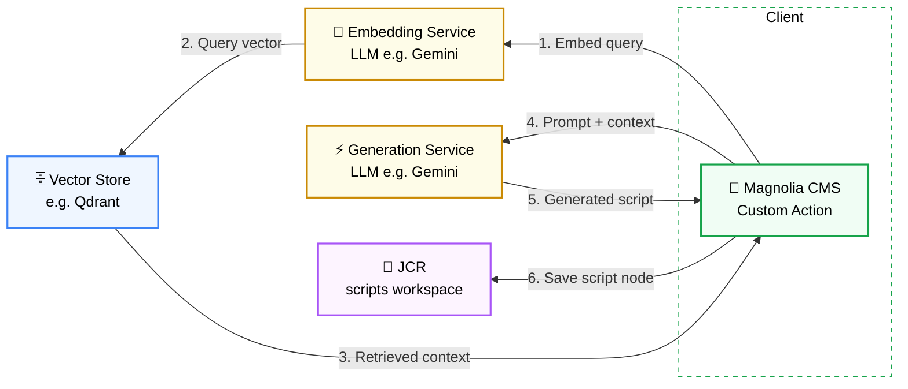

## Embedded (Magnolia-Native) Approach

This is a proof-of-concept exploring an alternative, Magnolia-native implementation of the Groovy Generator.

- **Primary approach:** calls an external FastAPI service over HTTP
- **This variant:** runs the full RAG pipeline directly inside Magnolia, eliminating the middleman service
  - Embedding
  - Vector search
  - Generation

**Trade-off:**
- Couples the module tightly to Magnolia's runtime and dependency footprint
- In exchange, removes the external service hop entirely

## Architecture



Unlike the loosely-coupled approach, there's no standalone REST API or FastAPI server — Magnolia calls the LLM and vector store directly, in-process. Embedding, retrieval, and generation all happen synchronously within the dialog action's execution, and the round-trip to build context and generate the script occurs entirely inside a single Magnolia request thread.

See the [`architecture discussion`](../../../README.md#architecture) for the full reasoning behind keeping the FastAPI approach as the primary implementation, with this serving as a secondary, scoped demo.

### Configuration

Before use, configure the following values via the Magnolia **Passwords app** at their respective paths:

| Path | Description |
|---|---|
| `/groovy-generator/embedded/llm/embed-endpoint` | Embedding endpoint URL for the LLM (e.g. Gemini) |
| `/groovy-generator/embedded/llm/generate-endpoint` | Generation endpoint URL for the LLM (e.g. Gemini) |
| `/groovy-generator/embedded/llm/model` | Model identifier to use for generation |
| `/groovy-generator/embedded/llm/api-key` | API key for the LLM provider |
| `/groovy-generator/embedded/vector-store/url` | Base URL for the vector store (e.g. Qdrant) |
| `/groovy-generator/embedded/vector-store/api-key` | API key for the vector store, if authentication is enabled |
| `/groovy-generator/embedded/vector-store/collection-name` | Name of the collection to search for retrieval context |

### Action Usage

Set the dialog's commit action `$type` to select which implementation runs:

```yaml
$type: generateScriptAction  # generateScriptAction (FastAPI) or generateScriptEmbeddedAction (Magnolia-native)
```